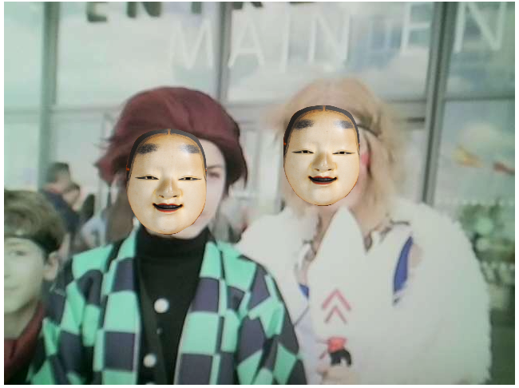

Face detection + wearing a mask demo

This demo is using [mediapipe's blaze face](https://github.com/tensorflow/tfjs-models/tree/master/blazeface).

According to my experiments, the max number of face detection was 3. If the size of faces are small, they are not detected comparing to the whole image size.